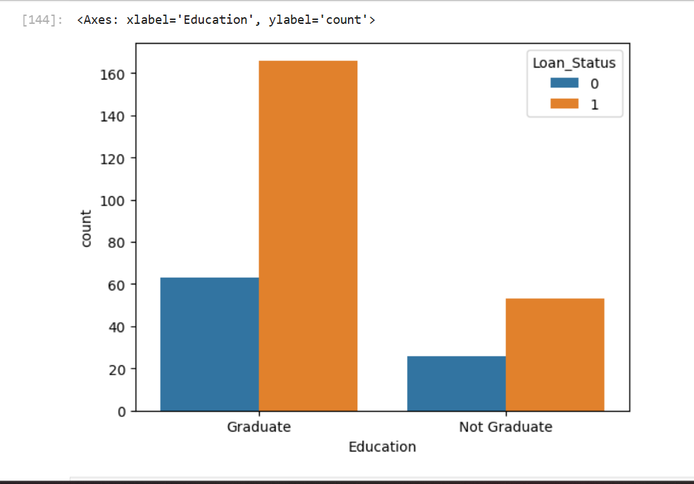
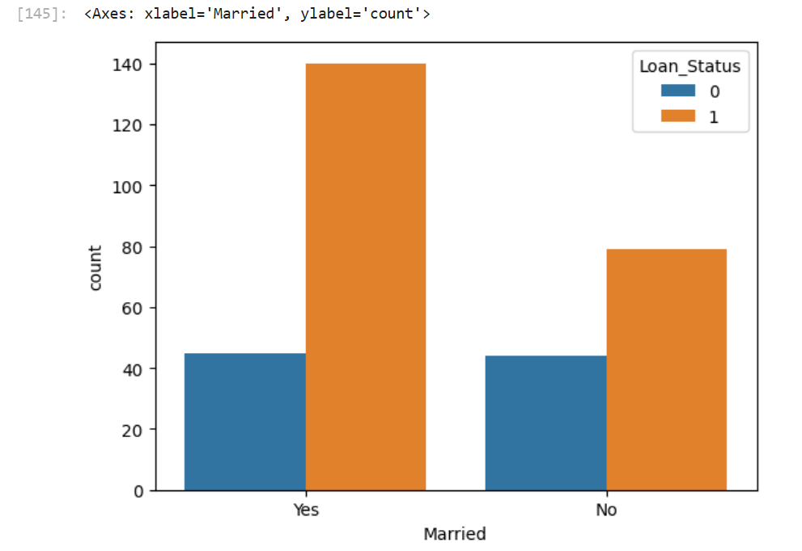

# Loan Status Prediction using SVM

A machine learning project that predicts whether a loan application will be **approved or rejected** based on applicant details, using a Support Vector Machine (SVM) classifier.

## 📌 Overview

Financial institutions receive large volumes of loan applications and need a fast, consistent way to assess creditworthiness. This project builds a binary classification model that predicts loan approval status (`Y`/`N`) from applicant and loan attributes such as income, credit history, and employment status.

## 📂 Repository Structure

```
loan-status-prediction/
├── loan_status_prediction_using_svm.ipynb   # Main notebook: EDA, preprocessing, model training & evaluation
├── loan_data.csv                            # Dataset used for training/testing
├── education_count.png                      # EDA: applicant count by education level
├── married_count.png                        # EDA: applicant count by marital status
└── README.md
```

## 📊 Dataset

The dataset (`loan_data.csv`) contains historical loan applications with features including:

| Feature | Description |
|---|---|
| `Gender` | Applicant gender |
| `Married` | Marital status |
| `Dependents` | Number of dependents |
| `Education` | Graduate / Not Graduate |
| `Self_Employed` | Employment type |
| `ApplicantIncome` | Applicant's income |
| `CoapplicantIncome` | Co-applicant's income |
| `LoanAmount` | Loan amount requested |
| `Loan_Amount_Term` | Term of the loan (in months) |
| `Credit_History` | Whether applicant meets credit guidelines |
| `Property_Area` | Urban / Semiurban / Rural |
| `Loan_Status` | Target variable — loan approved (`1`) or not (`0`) |

*(Update this table if your actual columns differ.)*

## ⚙️ Approach

1. **Exploratory Data Analysis (EDA)** — examined distributions of categorical features such as education and marital status, and their relationship with loan approval.
2. **Data Preprocessing** — handled missing values, encoded categorical variables (label encoding), and prepared features for modeling.
3. **Model Training** — trained a **Support Vector Machine (SVM)** classifier using scikit-learn.
4. **Evaluation** — assessed model performance using accuracy on train/test splits.

## 📊 Exploratory Data Analysis

**Loan approval by education level** — graduates are approved at a noticeably higher rate than non-graduates:



**Loan approval by marital status** — married applicants are approved at a higher rate than unmarried applicants:



## 🛠️ Tech Stack

- Python
- Pandas, NumPy — data handling
- Matplotlib / Seaborn — visualization
- scikit-learn — SVM model, preprocessing, evaluation

## 🚀 Getting Started

### Prerequisites
```bash
pip install numpy pandas matplotlib seaborn scikit-learn
```

### Run
1. Clone the repository:
   ```bash
   git clone https://github.com/anshikagandhi03-star/loan-status-prediction.git
   cd loan-status-prediction
   ```
2. Open the notebook:
   ```bash
   jupyter notebook loan_status_prediction_using_svm.ipynb
   ```
3. Run all cells to reproduce the EDA, preprocessing, and model training/evaluation.

## 📈 Results

The trained SVM model achieves an accuracy of **XX%** on the test set.
*(Replace with your notebook's actual reported accuracy/precision/recall.)*

## 🔮 Future Improvements

- Compare SVM against other classifiers (Logistic Regression, Random Forest, XGBoost)
- Handle class imbalance if present in `Loan_Status`
- Hyperparameter tuning (kernel, C, gamma) via GridSearchCV
- Deploy as a simple web app (Streamlit/Flask) for interactive predictions

## 👤 Author

**Anshika Gandhi**
[GitHub](https://github.com/anshikagandhi03-star)

## 📄 License

This project is open source and available for educational use.
